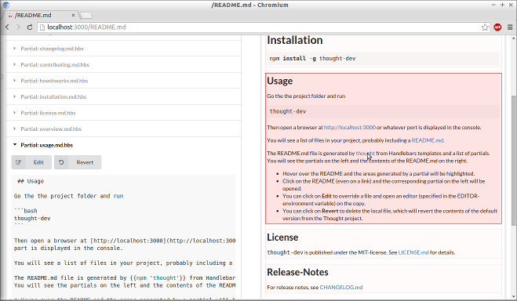

# thought-dev 

[](http://badge.fury.io/js/thought-dev)
[](https://travis-ci.org/nknapp/thought-dev)
[](https://coveralls.io/r/nknapp/thought-dev)


> Development-Mode for Thought

This project is a development-mode for the [thought](https://npmjs.com/package/thought) project. It shows you, which
partials are currently in use and allows you to override partials and store them in the appropriate
locations.

**Use at your own risk. This package is highly experimental. It works for me, kind of, but there
are no tests at all. And sometimes, the server just breaks down. The code is not clean and everything
is somehow work in progress. I'm publishing it anyhow.**


# Installation

```
npm install -g thought-dev
```

 ## Usage

Go the the project folder and run 

```bash
thought-dev
```

Then open a browser at [http://localhost:3000](http://localhost:3000) or whatever
port is displayed in the console.

You will see a list of files in your project, probably including a [README.md](http://localhost:3000/README.md).

The README.md file is generated by [thought](https://npmjs.com/package/thought) from Handlebars templates and a list of partials.
You will see the partials on the left and the contents of the README.md on the right.

* Hover over the README and the areas generated by a partial will be highlighted. 
* Click on the README (even on a link) and the corresponding partial on the left will be opened. 
* You can click on **Edit** to override a file and open an editor (specified in the EDITOR-environment variable) on the copy.
* You can click on **Revert** to delete the local file, which will revert the contents of the default version from the Thought project.




## License

`thought-dev` is published under the MIT-license. 
See [LICENSE.md](LICENSE.md) for details.

## Release-Notes
 
For release notes, see [CHANGELOG.md](CHANGELOG.md)
 
## Contributing guidelines

See [CONTRIBUTING.md](CONTRIBUTING.md).